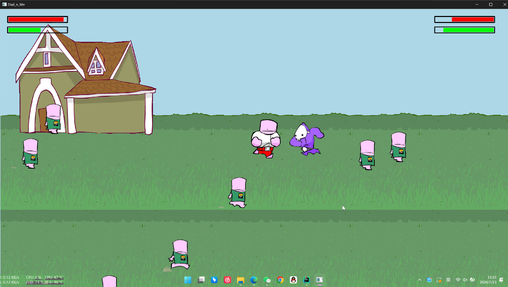

# Dad'n Me
> 本仓库为《C++项目管理及工程实践》项目仓库
> 
> 为2024年浙江大学暑学期课程 课程综合实践Ⅱ 系列课程
> 
> 仅供学习参考交流
- main分支->[Star0228](https://github.com/Star0228)
- Thorin分支->[Thorin215](https://github.com/Thorin215)
- xzkz分支->[forsur](https://github.com/forsur)

## 运行步骤(Clion+Qt)
1. 配置好`Qt6`后在`Clion`中运行`Cmake`([配置Qt6参考博客](https://www.cnblogs.com/hanlulu1998/p/17989683))
2. 点击右上角的绿色箭头来进行项目运行

## 预期效果图

